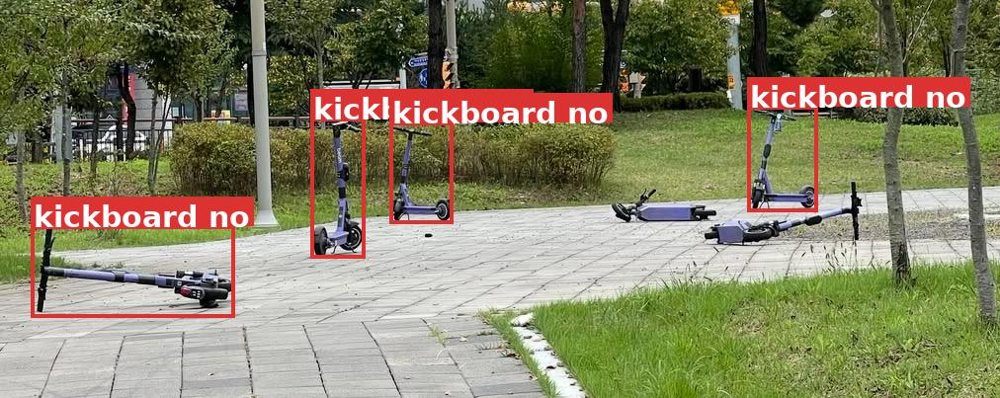
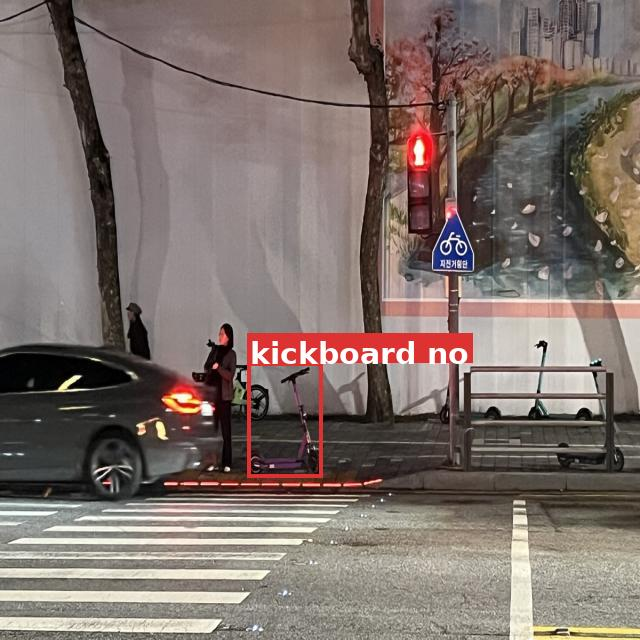

# 🛴 Pm_Security

<p align="left">
  
  
  
  
</p>

> **2026년 1학기 한양대학교 ERICA 텐서프로그래밍 기말 프로젝트** 

> 객체인식을 활용한 개인형 이동장치(PM)의 불법주차 및 불법주행 자동 단속 시스템

## 📖 Project Overview
최근 도심 내 공유 킥보드와 자전거(PM)의 무분별한 무단 방치와 불법 주행으로 인한 보행 안전 문제가 심각해지고 있습니다. 특히 한양대 에리카캠퍼스가 위치한 안산시는 경기도 내 개인형 이동장치(PM) 사고 발생 건수 1위를 기록했으며, 2026년 5월부터는 특정 구역에서는 즉시 견인 방침을 발표하기도 했습니다. 본 프로젝트는 **객체 인식**을 활용하여 <u>안전을 위협하는 고위험 불법 주차 및 주행 행위</u>를 실시간으로 탐지하고 관리하는 시스템의 프로토타입을 제안합니다.


### 🎯 주요 탐지 대상
* **불법 주차:** 횡단보도 3m 이내, 점자블록 위, 도로 위, 지하철역 주변 등 보행 및 차량 안전을 직접 위협하는 구역
* **불법 주행:** 헬멧 미착용, 2인 이상 탑승 등 육안으로 식별 가능한 위험 주행

### 🏗️ System Architecture__Driving Part
주행 탐지 시스템은 단순 객체 탐지의 한계를 극복하기 위해 **Two-Layer 구조**로 설계되었습니다.

```text
Input Image
      │
      ▼
┌────────────────────┐
│ Layer 1            │
│ YOLO26n Detection  │
│ (Object Detection) │
└────────────────────┘
      │
      ▼
┌─────────────────────────────┐
│ Layer 2                     │
│ Spatial Logic Gate Engine   │
│ - IoU Filtering             │
│ - Foot-Point Dependency     │
│ - Geometric Validation      │
└─────────────────────────────┘
      │
      ▼
NORMAL / ABNORMAL
```
1. [**Layer 1 (Object Detection)**](https://github.com/tensor-programming-2026/pm_security/blob/main/docs/Driving_Layer1.md): YOLO26n 기반 4가지 클래스(`human`, `kickboard`, `helmet`, `bare_head`) 탐지
2. [**Layer 2 (Spatial Logic Gate)**](https://github.com/tensor-programming-2026/pm_security/blob/main/docs/Driving_Layer2.md): 탐지된 객체 간의 공간적 교집합(IoU) 및 원근법 종속성을 수학적으로 연산하여 최종 위반 판별

### Layer2 Abnormal 탐지 결과 이미지


### 🏗️ System Architecture__Parking Part
 
주차 위반은 구역과 PM 상태를 **하나의 모델이 동시에 판단**하도록 설계했습니다. Grounding DINO(Tiny)를 8개 클래스로 파인튜닝하여, 탐지 클래스 자체가 곧 위반 판별 결과가 됩니다.
 
```text
Input Image
      │
      ▼
┌──────────────────────────────────┐
│ Grounding DINO (finetuned)       │
│ BERT + GDINO-T pretrained weight │
│                                  │
│ Classes:                         │
│  구역: crosswalk, tactile_paving │
│        parking_zone              │
│  PM:   kickboard_ok / _no        │
│        ebike_ok / _no            │
│  기타: human                     │
└──────────────────────────────────┘
      │
      ▼
ok / no 클래스로 위반 즉시 판별
```
 
- `crosswalk`, `tactile_paving`: 보행 안전을 위협하는 금지 구역
- `parking_zone`: 주차 허용 구역 (단, 금지 구역 인접으로 인한 경계 케이스 존재)
- `kickboard_ok` / `kickboard_no`, `ebike_ok` / `ebike_no`: 정상/위반 상태가 클래스에 내재화

### 탐지 결과 이미지





> **⚠️ 한계:** 현재 데이터 수 부족 및 일부 품질 이슈로 인해 특정 케이스에서 오탐이 발생합니다. 현재의 모델은 개념을 구현한 프로토타입이며, 충분한 데이터 학습 및 탐지 로직 개선이 필요합니다.
 
---

## 💻 실행 방법__Driving Part

주행 탐지 기능의 모든 핵심 파이프라인(데이터 전처리, 추론, 정량 평가)은 Google Colab 환경에서 원클릭으로 재현할 수 있도록 주피터 노트북(`.ipynb`) 파일에 모두 통합되어 있습니다.

### 📌 Step 1. 사전 데이터 준비
1. 학습이 완료된 모델 가중치 파일(`best.pt`)과 이미지 데이터셋 압축 파일(`dataset_3.yolo26.zip`)을 다운로드합니다.
2. 위 두 파일을 본인의 **구글 드라이브 내 특정 폴더**(예: `MyDrive/pm_security/`)에 미리 업로드해 둡니다.

### 📌 Step 2. 노트북 파일 환경 세팅
1. 본 Repository의 model에 첨부된 `1st_test.ipynb`을 컴퓨터에 다운로드합니다.
2. Google Colab에 접속한 뒤 다운로드한 `.ipynb` 파일을 엽니다.

### 📌 Step 3. 파이프라인 실행
업로드된 코랩 환경에서 위에서부터 순서대로 코드 셀을 실행(Shift + Enter)하거나, 상단의 [런타임] ➡️ [모두 실행]을 클릭합니다. 노트북 내부에는 다음의 전체 과정이 자동화되어 있습니다.

1. **환경 세팅:** 구글 드라이브 마운트 및 데이터셋 로컬 초고속 복사 (최초 1회 구글 로그인 권한 승인 필요)
2. **데이터 전처리:** `test` 데이터셋 8:1:1 자동 분할 및 메타데이터(`data.yaml`) 동적 업데이트
3. **알고리즘 추론:** YOLO26n 기반 1차 객체 탐지(NMS 적용) 및 2차 기하학적 공간 필터링 알고리즘 가동
4. **결과 시각화:** 실시간 위반 차량 적발 화면 및 최종 성능 지표(mAP, 혼동 행렬) 출력

> **💡 TroubleShooting:** 만약 파일을 찾을 수 없다는 경로 에러가 발생할 경우, 노트북 최상단 셀의 구글 드라이브 복사 경로(`!cp /content/drive/MyDrive/pm_security/...`)가 본인이 실제로 드라이브에 파일을 업로드한 경로와 일치하는지 확인해 주세요.

## 💻 실행 방법__Parking Part

주차 탐지 기능의 학습에 [Open-GroundingDINO](), 추론에 [GroundingDINO]()를 사용했습니다.

### 📌 Step 1. 의존성 설치
- 가상환경 생성
```bash
conda create -n pm_security python=3.11 -y
conda activate pm_security
```

- CUDA 세팅
```bash
conda install -c "nvidia/label/cuda-12.1.0" cuda-toolkit cuda-nvcc
pip install torch==2.1.2 torchvision==0.16.2 --index-url https://download.pytorch.org/whl/cu121
conda install -c conda-forge gxx_linux-64=12 gcc_linux-64=12 -y

which nvcc # 이때 확인된 nvcc의 bin 상위 디렉토리를 CUDA_HOME에 등록 (예: /usr/local/cuda/bin/nvcc → CUDA_HOME=/usr/local/cuda)

echo 'export CUDA_HOME=/path/to/cuda' >> ~/.bashrc
source ~/.bashrc
conda activate gdino # source하면서 자동으로 deactivate되므로 다시 활성화
echo $CUDA_HOME  # export 확인
```

- 프로젝트 기본 라이브러리 설치
```bash
pip install -e .
```

### 📌 Step 2. Finetuning
- Open-GroundingDINO 의존성 설치
```bash
cd third_party/Open-GroundingDINO
pip install -r requirements.txt

cd models/GroundingDINO/ops
python setup.py build install
python test.py
```

- [GroundingDINO-T
(pretrain)](https://github.com/longzw1997/Open-GroundingDino/releases/download/v0.1.0/gdinot-1.8m-odvg.pth) 모델을 다운로드 후 weights 디렉토리에 저장합니다.
- [BERT](https://huggingface.co/bert-base-uncased) 모델이 사용됩니다. 해당 모델은 온라인 환경에서 코드를 통해 다운로드됩니다.

- 프로젝트를 위해 추가한 파일은 다음과 같습니다.
```
  config/pm_coco_odvg.json   ← 데이터셋 설정
  logs/plot_graph.py         ← 학습 로그 시각화
```

- 프로젝트를 위해 수정한 파일은 다음과 같습니다.
```
  train_dist.sh              ← 학습 실행 스크립트
  config/cfg_odvg.py         ← 학습 파라미터 설정
```

- 학습 실행
```bash
bash train_dist.sh 1 config/cfg_odvg.py config/pm_coco_odvg.json ./logs 2>&1 | tee log/train_open_gdino.log
```

- 학습 후 생성되는 로그 파일: ```logs/train_open_gdino.log```
- 학습 로그 시각화 예시: ```logs/train_progress.png```

### 📌 Step 3. Inference

- GroundingDINO 의존성 설치
```bash
cd third_party/GroundingDINO
python -m pip install --no-build-isolation -e .
```

- 추론
```bash
CUDA_VISIBLE_DEVICES=0 python demo/inference_on_dir.py \
-c weights/config_cfg.py \
-p weights/checkpoint_best_regular.pth \
-i test_data \
-o logs/test_data \
-t "crosswalk . ebike no . ebike ok . kickboard no . kickboard ok . parking zone . tactile paving ."
```
- 학습된 가중치로 이미지에 대해 추론을 실행합니다.
- 탐지된 클래스(`kickboard_ok`/`kickboard_no`, `ebike_ok`/`ebike_no`)가 곧 위반 판별 결과입니다.